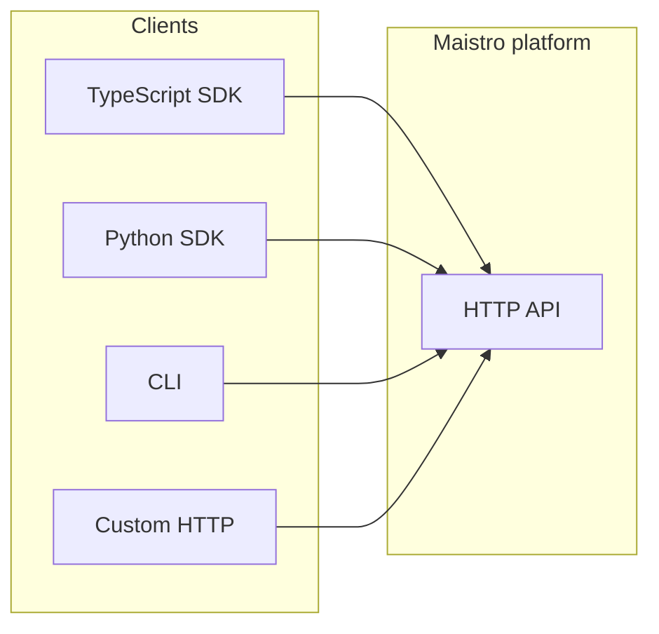

For bounded contexts and ubiquitous language in DDD terms, see [Domain model](/docs/api-design/domain-model).

## System context

Applications integrate through **client SDKs** (TypeScript, Python) or direct HTTP calls. The SDKs are thin layers over the same **Maistro platform API** hosted at `https://backend.maistro.dev` (see `servers` in the published OpenAPI spec).

The repository that publishes this documentation **ships SDKs and docs**; it does **not** host the API server implementation. Behavior that is not visible in OpenAPI or SDK source must be confirmed with the platform team.

## HTTP API versioning

Maistro exposes **two URL families** for the REST API:

| Version | Base path (typical) | Docs |
|--------|---------------------|------|
| **v3.1** (current default) | `/api/v3.1/...` | [API reference](/reference/api-reference) |
| **v3.0** | `/api/v3/...` | [v3 API reference](/reference/v3/api-reference) |

The docs site mounts both trees with a version switcher. See the maintainer notes in the repo’s `docs/.claude/context/api-reference.md` for URL layout and how `fetch-openapi.mjs` produces `public/openapi.json` (v3.1) and `public/openapi-v3.json` (v3.0).

**Distinct from URL versioning:** **toolkit versions** (e.g. dated slugs like `20250909_00`) control which integration definitions run for a toolkit. SDKs pass these via config and execute payloads; see [Toolkit versioning](/docs/tools-direct/toolkit-versioning) and the [contracts](/docs/api-design/contracts) page.

## OpenAPI tags (domains)

The filtered public spec lists tags that group operations. Use them as the mental model for “what subsystem” an endpoint belongs to:

| Tag | Responsibility |
|-----|------------------|
| **Authentication** | Session/auth info (e.g. `/api/v3.1/auth/session/info`) |
| **Auth Configs** | Auth configuration CRUD for toolkits |
| **Connected Accounts** | User connections to third-party apps, link flows, refresh |
| **Tools** | List/retrieve tools, execute, proxy, input helpers |
| **Toolkits** | Toolkit metadata, categories, multi-toolkit fetch |
| **Tool Router** | Session-based discovery and execution for agentic flows |
| **Triggers** / **Triggers** (types) | Trigger type catalog; **Trigger instances** for active subscriptions and management |
| **MCP** | MCP server lifecycle, URLs, custom servers |
| **Files** | List, upload request / presigned flows |
| **Webhooks** | Webhook subscription management |
| **Organization** / **API Keys** / **Team** / **Payments** | Org, project keys, billing-adjacent surfaces (see spec for scope) |
| **Recipes** | Recipe modules combining tools |
| **Migration** | Aids for v1 → v3 migration |
| **Logs** / **OpenAPI** | Operational or meta endpoints per spec |

Internal-only tags (e.g. **CLI**, **Admin**, **Profiling**) are removed by `docs/scripts/fetch-openapi.mjs` for public docs.

## Path prefixes (v3.1)

Grouping by URL prefix clarifies routing layers (from `public/openapi.json`):

| Prefix | Domain |
|--------|--------|
| `/api/v3.1/tools` | Tool listing, enum, retrieve, execute, proxy, scopes |
| `/api/v3.1/toolkits` | Toolkit list, categories, single/multi retrieve |
| `/api/v3.1/auth_configs` | Auth config resources |
| `/api/v3.1/connected_accounts` | Connections, status, refresh, link |
| `/api/v3.1/tool_router/session` | Tool Router session CRUD, execute, search, toolkits, tools, mounts |
| `/api/v3.1/trigger_instances` | Upsert, active list, manage |
| `/api/v3.1/triggers_types` | Trigger type list, retrieve, enum |
| `/api/v3.1/mcp` | MCP servers, generate, instances |
| `/api/v3.1/files` | File list, upload request |
| `/api/v3.1/webhook_subscriptions` | Webhook CRUD and secrets |
| `/api/v3.1/org` | Organization / project usage and config |

Exact paths and methods are defined in the [API reference](/reference/api-reference); this table is for navigation only.

## SDK namespaces ↔ domains (summary)

| SDK surface (`Maistro`) | Primary OpenAPI domain |
|--------------------------|-------------------------|
| `tools` | Tools (+ parts of Tool Router when listing session tools) |
| `toolkits` | Toolkits |
| `authConfigs` | Auth Configs |
| `connectedAccounts` | Connected Accounts (+ `link`) |
| `triggers` | Trigger instances + trigger types |
| `toolRouter` / `create` / `use` | Tool Router |
| `mcp` | MCP |
| `files` | Files |

See [SDK–API mapping](/docs/api-design/sdk-api-mapping) for precise client method names.
