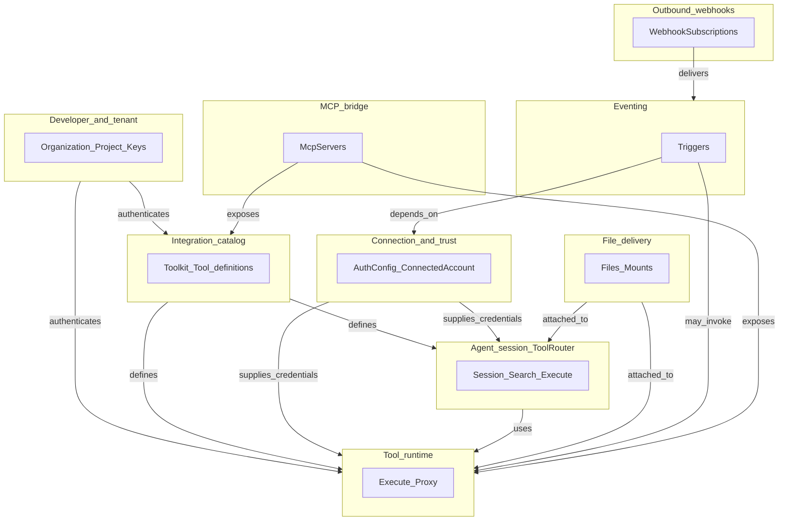

This page describes **domain boundaries** in Domain-Driven Design terms: **ubiquitous language**, **bounded contexts**, and how they relate to the public HTTP API and SDKs. It is derived from OpenAPI tags and core SDK namespaces.

**Caveat:** This reflects **public API and SDK structure**. Actual microservice boundaries on the backend may differ; use this as a **language and ownership** guide for docs, SDK modules, and cross-team contracts—not as proof of deployment topology. For an internal validation checklist, see [`docs/internal/DDD_PLATFORM_ALIGNMENT.md`](https://github.com/MaistroHQ/maistro/blob/next/docs/internal/DDD_PLATFORM_ALIGNMENT.md) in the repository.

## Ubiquitous language (core terms)

Terms that appear consistently across the OpenAPI spec and SDKs: **Toolkit**, **Tool** (schema + slug), **Tool execution**, **Toolkit version**, **Auth config**, **Connected account**, **Tool Router session**, **Trigger type**, **Trigger instance**, **MCP server**, **File** (upload/list), **Webhook subscription**, **Organization / Project / API key**. These anchor the boundaries below. **Extend this list** when product language adds new concepts (and add a row to the entities registry if it maps to a stored or API-addressable thing).

## Registries (living — domains and entities evolve here)

Use these tables as the **canonical inventory**. When the API or SDK gains a new first-class area:

1. Add or update a **domain** row (new slug—do not renumber existing slugs).
2. Add **entity / aggregate** rows under that domain (or under an existing domain).
3. Update the narrative **Bounded contexts** section, **context map** Mermaid diagram, and [SDK–API mapping](/docs/api-design/sdk-api-mapping) as needed.
4. Append the **revision log** at the bottom of this page.

**Splitting or merging domains** is allowed: deprecate a slug in the revision log, add the replacement row, and update cross-references in one PR.

### Domain registry

| Slug | Domain | Primary OpenAPI tags (indicative) |
|------|--------|-----------------------------------|
| `integration-catalog` | Integration catalog | Toolkits, Tools (discovery) |
| `tool-runtime` | Tool runtime | Tools (execute, proxy, input) |
| `agent-session` | Agent session (Tool Router) | Tool Router |
| `connection-trust` | Connection and trust | Auth Configs, Connected Accounts, Authentication |
| `developer-tenant` | Developer and tenant platform | Organization, API Keys, Team, Payments |
| `eventing` | Eventing and automation | Triggers |
| `outbound-webhooks` | Outbound notifications | Webhooks |
| `mcp-bridge` | Protocol bridges (MCP) | MCP, MCP Partner |
| `file-delivery` | File delivery | Files |
| `composition` | Composition (Recipes) | Recipes, Recipe |
| `platform-supporting` | Platform operations and migration | Logs, OpenAPI, Migration |

### Entity and aggregate registry

| Domain slug | Entity / aggregate | Kind | Notes |
|-------------|-------------------|------|-------|
| `integration-catalog` | `Toolkit` | aggregate root | Versioned integration family |
| `integration-catalog` | `Tool` | aggregate / entity | Catalog definition; slug + schema |
| `integration-catalog` | Toolkit version pin | value / policy | Often embedded in tool/toolkit APIs |
| `tool-runtime` | `ToolExecution` / `Invocation` | aggregate / process | Run record; depends on catalog + optional connection |
| `agent-session` | `ToolRouterSession` | aggregate root | Session id scopes discovery and execute |
| `agent-session` | Session file mount | entity | Lifecycle tied to session |
| `connection-trust` | `AuthConfig` | aggregate root | Per-toolkit auth setup |
| `connection-trust` | `ConnectedAccount` | aggregate root | User link to third party |
| `connection-trust` | Link / OAuth flow | process | May persist as state machine or short-lived token |
| `developer-tenant` | `Organization` | aggregate root | |
| `developer-tenant` | `Project` | aggregate root | |
| `developer-tenant` | `ApiKey` | entity | |
| `developer-tenant` | `TeamMember` | entity | |
| `developer-tenant` | Usage / billing snapshot | entity / report | As exposed by API |
| `eventing` | `TriggerType` | entity / catalog | |
| `eventing` | `TriggerInstance` | aggregate root | Subscription |
| `outbound-webhooks` | `WebhookSubscription` | aggregate root | Customer URL delivery |
| `mcp-bridge` | `McpServer` | aggregate root | |
| `mcp-bridge` | `McpInstance` | entity | Per spec |
| `file-delivery` | `File` | aggregate root | Blob metadata / refs |
| `composition` | `Recipe` | aggregate root | Composed modules |
| `platform-supporting` | Log / audit record | entity | As exposed |
| `platform-supporting` | Migration job / mapping | process / entity | Legacy bridge |

*Kind* is a DDD hint, not a storage spec. **Add rows** when new aggregates appear in the API; **edit Notes** when behavior changes.

## Bounded contexts (recommended)

Each block is a **cohesive area of behavior and data** with its own model; integrations happen via **published APIs** or **foreign keys** (IDs passed between contexts), not by sharing internal persistence across teams.

### 1. Integration catalog (`integration-catalog`)

See [domain registry](#domain-registry) / [entity registry](#entity-and-aggregate-registry).

**Responsibility:** What integrations exist and how they are described—toolkits, tools, input/output schemas, categories, **versioned** definitions.

**Primary aggregates:** `Toolkit`, `Tool` (as catalog entries), version pins.

**OpenAPI / SDK alignment:** Tags **Toolkits**, **Tools** (list, retrieve, enum, scopes—not execute). SDK: `Toolkits`, discovery paths on `Tools`.

**Boundary note:** Catalog answers “what *can* run?”; it does not imply a run happened.

---

### 2. Tool runtime (`tool-runtime`)

See [entity registry](#entity-and-aggregate-registry).

**Responsibility:** Running a tool with arguments against a user’s context—validation, routing to the right integration worker, returning structured success/error.

**Primary aggregates:** `ToolExecution` (or `Invocation`) as a process/record, keyed by tool slug + version + user/connection context.

**OpenAPI / SDK alignment:** **Tools** (execute, proxy, input). SDK: `tools.execute`, `tools.proxy`, related modifiers.

**Boundary note:** Depends on **catalog** (which schema/version) and **connection** (optional `connected_account_id`). Keep execution policies (timeouts, retries) here, not in catalog.

---

### 3. Agent session (`agent-session`)

See [entity registry](#entity-and-aggregate-registry).

**Responsibility:** **Session-scoped** agent workflows: create/use session, search tools, session execute / proxy / meta, toolkit scoping, **session file mounts**.

**Primary aggregates:** `ToolRouterSession` (lifecycle owns session id, allowed toolkits, discovery state).

**OpenAPI / SDK alignment:** Tag **Tool Router**; paths under `/tool_router/session/...`. SDK: `toolRouter`, `create` / `use`, `ToolRouter`, `ToolRouterSession`.

**Boundary note:** Overlaps **tool runtime** conceptually but with a **different aggregate** (session vs one-shot). Do **not** model session execution as stateless execute without the session id.

---

### 4. Connection and trust (`connection-trust`)

See [entity registry](#entity-and-aggregate-registry).

**Responsibility:** Storing and refreshing OAuth tokens, linking accounts, enabling/disabling connections, **auth config** templates per toolkit.

**Primary aggregates:** `AuthConfig`, `ConnectedAccount`, link / OAuth **link** flows.

**OpenAPI / SDK alignment:** Tags **Auth Configs**, **Connected Accounts**, **Authentication** (session info); link routes. SDK: `authConfigs`, `connectedAccounts`.

**Boundary note:** This is **not** the same as **developer API keys** (below). Use clear language: *user connection* vs *project API key*.

---

### 5. Developer and tenant platform (`developer-tenant`)

See [entity registry](#entity-and-aggregate-registry).

**Responsibility:** Organizations, projects, API keys, team membership, usage summaries, billing hooks.

**Primary aggregates:** `Organization`, `Project`, `ApiKey`, `TeamMember`, usage/billing where exposed.

**OpenAPI / SDK alignment:** Tags **Organization**, **API Keys**, **Team**, **Payments**; path prefix `/org/...` in the v3.1 API. Often **not** wrapped in `@maistro/core`’s main agent-facing surface—more dashboard/CLI.

**Boundary note:** **Cross-cutting** for authN to the API (`x-api-key`, `x-org-api-key`, `x-user-api-key`) but the **domain** of “who owns projects and keys” is separate from “what tools exist.”

---

### 6. Eventing and automation (`eventing`)

See [entity registry](#entity-and-aggregate-registry).

**Responsibility:** Registering and managing **triggers**—types, instances, active subscriptions, management lifecycle.

**Primary aggregates:** `TriggerType`, `TriggerInstance` (subscription).

**OpenAPI / SDK alignment:** Tags **Triggers**; `trigger_instances`, `triggers_types` paths. SDK: `Triggers`.

**Boundary note:** Integrates with **catalog** (which tools can fire) and **connections** (which account receives events). Outbound delivery to customers may pair with **Webhooks** (below).

---

### 7. Outbound notifications (`outbound-webhooks`)

See [entity registry](#entity-and-aggregate-registry).

**Responsibility:** Customer-facing webhook **subscriptions** (URLs, secrets, rotation)—Maistro → customer systems.

**Primary aggregates:** `WebhookSubscription`.

**OpenAPI / SDK alignment:** Tag **Webhooks**.

**Boundary note:** Distinct from **Triggers** (inbound from SaaS apps into Maistro). Name carefully in docs: *trigger instance* vs *webhook subscription*.

---

### 8. Protocol bridges (`mcp-bridge`)

See [entity registry](#entity-and-aggregate-registry).

**Responsibility:** Exposing Maistro capabilities as **MCP servers**—server CRUD, URL generation, instances.

**Primary aggregates:** `McpServer`, `McpInstance` (per spec).

**OpenAPI / SDK alignment:** Tag **MCP** (+ **MCP Partner** if applicable). SDK: `MCP`.

**Boundary note:** Different **delivery protocol** than REST tool execution; same underlying catalog/runtime may apply, but **configuration and lifecycle** are MCP-specific.

---

### 9. File delivery (`file-delivery`)

See [entity registry](#entity-and-aggregate-registry).

**Responsibility:** Storing and addressing blobs for tool I/O—list, presigned upload, session mount upload/download/delete.

**Primary aggregates:** `File` references; session-scoped mounts belong with **Tool Router session** for lifecycle.

**OpenAPI / SDK alignment:** Tag **Files**; Tool Router mount paths. SDK: `files`, session file helpers.

**Boundary note:** Often a **supporting subdomain** for **tool runtime** and **sessions**, not a standalone product—still a clear **boundary** for storage, encryption, and URL semantics.

---

### 10. Composition (`composition`)

See [entity registry](#entity-and-aggregate-registry).

**Responsibility:** Higher-level reusable modules combining multiple tools.

**Primary aggregates:** `Recipe` (per OpenAPI description).

**OpenAPI / SDK alignment:** Tags **Recipes** / **Recipe**. May be less exposed in core agent SDKs; still a boundary if product grows.

---

### 11. Platform operations and migration (`platform-supporting`)

See [entity registry](#entity-and-aggregate-registry).

**Responsibility:** Logs, OpenAPI meta, **Migration** from legacy APIs.

**OpenAPI / SDK alignment:** Tags **Logs**, **OpenAPI**, **Migration**.

**Boundary note:** Treat as **supporting contexts**—not core product language for integrators.

---

## Context map (relationships)

## Anti-corruption rules

- Do not merge **catalog** schemas into **execution** logs without an explicit mapping layer (DTO or event).
- **`connected_account_id`** is a **foreign key** from execution/session into the **Connection** context—never re-embed full OAuth state in tool args.
- **Session id** is the aggregate root for Tool Router flows; avoid “global” execute when the product promise is session-scoped.

## Evolution and maintenance (future-proofing)

This page is **not frozen**. It should stay aligned as the **public contract** (OpenAPI + SDKs) changes. Use the following so it can evolve without silent drift.

### Source of truth (in order)

1. **OpenAPI** — New or renamed tags, path families, or security schemes → update [Architecture](/docs/api-design/architecture) and the **[domain registry](#domain-registry)** (new slug row or tag column) when the product adds or renames a bounded context. Regenerate **per-domain OpenAPI slices** ([`docs/openapi/domains/`](https://github.com/MaistroHQ/maistro/blob/next/docs/openapi/domains/README.md) — run `node docs/openapi/domains/generate-domain-openapi.mjs` from repo root) so each `{slug}.openapi.yaml` stays aligned with `docs/public/openapi.json`.
2. **SDK surface** — New `Maistro` namespaces or generated `client.*` resources → update [SDK–API mapping](/docs/api-design/sdk-api-mapping), **[entity registry](#entity-and-aggregate-registry)** rows, and narrative subsections above.
3. **Platform reality** — Backend/service ownership shifts → run the [platform alignment checklist](https://github.com/MaistroHQ/maistro/blob/next/docs/internal/DDD_PLATFORM_ALIGNMENT.md) and add a row to the **revision log** below.

### When to edit this file

- A new **first-class product area** appears in the API (new tag group or major `/api/v3.1/...` prefix).
- **Tool Router**, **execution**, or **connection** semantics change in docs or SDK (e.g. new aggregate or deprecation).
- **Ubiquitous language** in the product changes (rename of concepts customers see).
- You are about to **publish an ADR** or public blog post that contradicts this page—reconcile first.

### What not to do

- Do not treat this as the **database schema**; keep implementation details in platform docs or ADRs.
- Do not duplicate the [OpenAPI backlog](/docs/api-design/openapi-backlog); link to it instead.
- If a boundary is **uncertain**, keep the caveat at the top of this page accurate and add a short note in the revision log.

### PR checklist (suggested)

- [ ] **Domain registry** — new/changed bounded context has a stable **slug** row (or deprecation noted in revision log if merged elsewhere).
- [ ] **Entity registry** — new aggregates/entities or **Kind** changes are reflected; ubiquitous language updated if customer-facing names changed.
- [ ] OpenAPI tag / path table in [Architecture](/docs/api-design/architecture) still matches `docs/public/openapi.json` after `fetch-openapi.mjs`.
- [ ] [SDK–API mapping](/docs/api-design/sdk-api-mapping) updated if `Maistro` or Python `HttpClient` gained or lost a major surface.
- [ ] Context map (Mermaid) updated if **relationships** between contexts changed.
- [ ] **Per-domain OpenAPI YAML** — `node docs/openapi/domains/generate-domain-openapi.mjs` run (or slices hand-edited with justification) when `/api/v3.1` paths shift; see [`docs/openapi/domains/README.md`](https://github.com/MaistroHQ/maistro/blob/next/docs/openapi/domains/README.md).
- [ ] **Revision log** entry added (date + one line).

### Revision log

| Date | Summary |
|------|---------|
| 2026-04-17 | Evolution section, registries, PR checklist; `docs/openapi/domains/*.openapi.yaml` slices + `generate-domain-openapi.mjs` (regenerate when `openapi.json` changes). |

## Related pages

- [Architecture](/docs/api-design/architecture) — OpenAPI tags and path prefixes
- [Lifecycles](/docs/api-design/lifecycles) — tool and session flows
- [SDK–API mapping](/docs/api-design/sdk-api-mapping) — keep in sync when SDK evolves
- [OpenAPI backlog](/docs/api-design/openapi-backlog) — spec gaps vs narrative
- Per-domain OpenAPI YAML ([`docs/openapi/domains/`](https://github.com/MaistroHQ/maistro/blob/next/docs/openapi/domains/README.md) in-repo) — machine-readable slices per bounded context
