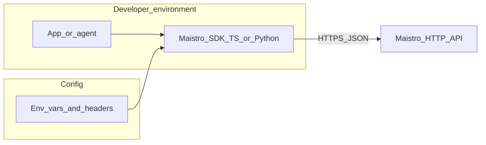
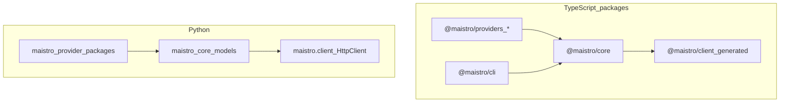

# Maistro SDK monorepo — architecture and code review

This internal document describes **how the official SDK clients are structured** in this repository, how they relate to the hosted Maistro HTTP API, and consolidated **review findings** for maintainers. It complements (does not replace) the published **API design** docs and the per-domain OpenAPI slices.

**Related docs (read these for HTTP/DDD detail):**

| Topic | Location |
|-------|----------|
| API design overview, lifecycles, contracts | [`../content/docs/api-design/index.md`](../content/docs/api-design/index.md) |
| Domain model (DDD), ubiquitous language | [`../content/docs/api-design/domain-model.md`](../content/docs/api-design/domain-model.md) |
| SDK ↔ HTTP client mapping | [`../content/docs/api-design/sdk-api-mapping.md`](../content/docs/api-design/sdk-api-mapping.md) |
| Platform/backend alignment checklist | [`DDD_PLATFORM_ALIGNMENT.md`](./DDD_PLATFORM_ALIGNMENT.md) |
| Prior structured review notes | [`CODE_REVIEW.md`](./CODE_REVIEW.md) |
| Per-domain OpenAPI YAML slices | [`../openapi/domains/README.md`](../openapi/domains/README.md) |

---

## 1. Executive summary

- **What this repo is:** A **monorepo of client SDKs and tooling** for Maistro: TypeScript (`@maistro/core`, `@maistro/client`, providers, CLI), Python (`python/maistro` + provider packages), shared utilities (`json-schema-to-zod`, `ts-builders`), documentation site (`docs/`), and cross-runtime **e2e** tests (`ts/e2e-tests/`).
- **What it is not:** The **Maistro backend** (API servers, workers, OAuth infrastructure). Clients call the hosted API using `MAISTRO_API_KEY` (and related config); see [`CODE_REVIEW.md`](./CODE_REVIEW.md) scope.
- **Architectural facts:**
  1. **Remote boundary:** Both SDKs target the same REST API; default base URL is configured in core (see `DEFAULT_BASE_URL` in `ts/packages/core/src/utils/constants.ts`).
  2. **TS stack:** `Maistro` wires `MaistroClient` from `@maistro/client` (generated/Stainless-style) to domain modules: `Tools`, `Toolkits`, `Triggers`, `AuthConfigs`, `ConnectedAccounts`, `MCP`, `Files`, `ToolRouter` (`ts/packages/core/src/maistro.ts`).
  3. **Python stack:** `Maistro` in `python/maistro/sdk.py` composes `HttpClient` from `maistro.client` with the same conceptual namespaces (`tools`, `tool_router`, …); naming follows Python conventions (`snake_case`).
  4. **Providers:** Framework adapters (OpenAI, Anthropic, LangChain, Mastra, etc.) sit in `ts/packages/providers/*` and `python/providers/*`; they map Maistro tool shapes to framework types and support **non-agentic** vs **agentic** modifier patterns (see `ts/packages/providers/README.md`).
  5. **CLI:** `ts/packages/cli` uses **Effect.ts**, **Bun**, `@effect/cli`, layered services (auth context, toolkit repository, session OAuth). Entry: `src/bin.ts` (see `ts/packages/cli/AGENTS.md`).
  6. **Versioning guardrail:** Direct `tools.execute` in TS can throw **`MaistroToolVersionRequiredError`** when the resolved toolkit version is `latest` without an explicit escape hatch (`ts/packages/core/src/errors/ToolErrors.ts`, `models/Tools.ts`).
  7. **Telemetry:** TS initializes telemetry when allowed; env `MAISTRO_DISABLE_TELEMETRY` is documented in root `AGENTS.md`.
  8. **CI split:** TS unit tests (`ts.test.yml`), Python matrix (`py.test.yml`), e2e with Docker (`ts.test-e2e.yml`) and secrets; docs data refresh (`docs-update-data.yml`) uses `MAISTRO_API_KEY` for OpenAPI fetch and generated content.
  9. **Workspace layout:** `pnpm-workspace.yaml` includes `ts/packages/*`, e2e packages, examples; root `package.json` scripts delegate to **Turbo** (`turbo.jsonc`).
  10. **Vendor:** `ts/vendor/` is read-only reference; do not treat as a normal dependency edit surface (`AGENTS.md`).

---

## 2. System context (C4-style)

**Actors:** Application code (or agent runtime) uses the SDK. **Configuration** supplies API key, base URL, toolkit versions, optional default headers. The SDK does not embed business persistence for Maistro tenants; it is a **thin client** with local helpers (file modifiers, CLI cache, etc.).

---

## 3. Container and package topology

**Dependency direction (intended):**

- `@maistro/core` depends on `@maistro/client` and implements domain models.
- `@maistro/<provider>` packages depend on `@maistro/core` (and peer framework deps).
- `ts/packages/cli` and `ts/packages/cli-keyring` depend on core (and Effect ecosystem).
- `json-schema-to-zod` / `ts-builders` are **libraries** consumed by tooling or tests (see e2e fixtures for json-schema-to-zod).

**pnpm workspaces** (see `pnpm-workspace.yaml`): core, cli, cli-keyring, providers glob, json-schema-to-zod, ts-builders, wrappers, e2e test packages, examples.

**Turbo tasks** (`turbo.jsonc`): `build` → `test`; e2e tasks require `MAISTRO_API_KEY`, `MAISTRO_USER_API_KEY`, `OPENAI_API_KEY` (and runtime-specific vars such as `MAISTRO_E2E_NODE_VERSION`).

---

## 4. Runtime and control flows

**Auth:** API key and optional headers flow from constructor/config/env into the generated client. CLI stores user context under `~/.maistro/` (see `ts/packages/cli/AGENTS.md` — `MaistroUserContext`).

**Tool discovery and execution:** Applications use `tools.get` / list flows, then `tools.execute` (or proxy). Session-based agent flows use **Tool Router** (`toolRouter`, `create`, `use` on TS `Maistro`). For sequence-level HTTP detail, link to [`../content/docs/api-design/lifecycles.md`](../content/docs/api-design/lifecycles.md).

**OAuth and connections:** `AuthConfigs` and `ConnectedAccounts` wrap the auth-config and connected-account API surfaces; link flows align with the **connection-trust** domain in OpenAPI slices.

---

## 5. Data and configuration

| Concern | TS (representative) | Notes |
|---------|---------------------|--------|
| API key | `apiKey` in `MaistroConfig`, env | See `getSDKConfig` in `ts/packages/core/src/utils/sdk.ts` |
| Base URL | `baseURL` | Overrides default backend URL |
| Toolkit versions | `toolkitVersions`, env `MAISTRO_TOOLKIT_VERSION_*` | Enforced on execute path |
| File IO | `autoUploadDownloadFiles`, file modifiers | See lifecycles doc — file-delivery vs session mounts |
| Logging | `MAISTRO_LOG_LEVEL`, logger util | `ts/packages/core/src/utils/logger.ts` |

Python mirrors via `SDKConfig` in `python/maistro/sdk.py` (`api_key`, `base_url`, `toolkit_versions`, `auto_upload_download_files`, …).

---

## 6. Cross-cutting concerns

**Errors:** Prefer shared error classes under `ts/packages/core/src/errors/` for stable handling. `MaistroToolVersionRequiredError` is the flagship guardrail for production execution without pinned toolkit versions.

**Telemetry:** Opt-in/opt-out behavior and PR review expectations are summarized in [`CODE_REVIEW.md`](./CODE_REVIEW.md) §4.5.

**Logging:** Development/CI detection uses constants in `ts/packages/core/src/utils/constants.ts`.

**Client duplication:** TS and Python each ship a generated HTTP client; fixes to request/response behavior may need **parallel** changes and tests ([`CODE_REVIEW.md`](./CODE_REVIEW.md) §4.3).

---

## 7. Testing strategy

| Layer | Location | Purpose |
|-------|----------|---------|
| Unit / package tests | `ts/packages/*/test`, `python/` pytest | Model and client behavior |
| Example validation | `pnpm run test:examples` (`ts/scripts/validate-examples.ts`) | Examples stay runnable |
| E2E | `ts/e2e-tests/` | Docker-isolated Node, Deno, Cloudflare Workers, CLI; needs live API keys |

**E2E CI** (`.github/workflows/ts.test-e2e.yml`): matrices for Node (`20.18.0`, `20.19.0`, `22.12.0`), Deno (`2.6.7`), Cloudflare and CLI jobs; secrets `MAISTRO_API_KEY`, `MAISTRO_USER_API_KEY`, `OPENAI_API_KEY`. Fork PRs typically cannot access these secrets—document contributor expectations in `CONTRIBUTING.md` if not already ([`CODE_REVIEW.md`](./CODE_REVIEW.md) §4.2).

**Python CI** (`py.test.yml`): Python `3.10`–`3.12` matrix, UV-based install.

**TS unit CI** (`ts.test.yml`): `pnpm install` + `pnpm run test` (no secrets required for default unit path).

---

## 8. Operational and maintainer concerns

- **Releases:** Changesets (`pnpm changeset`, `changeset:version`, `changeset:release`) per root `package.json`.
- **Docs data:** Scheduled and dispatch triggers refresh toolkits data, fetch OpenAPI (`docs/scripts/fetch-openapi.mjs`), regenerate API index — requires `MAISTRO_API_KEY` in CI.
- **OpenAPI domain slices:** Regenerate with `node docs/openapi/domains/generate-domain-openapi.mjs` when `docs/public/openapi.json` changes; watch for **drift** ([`../openapi/domains/README.md`](../openapi/domains/README.md)).

---

## 9. Subsystem review (template summary)

Each area: *Responsibility → Entry points → Boundaries → Errors/telemetry → Tests → Notes.*

### P0 — TypeScript core (`@maistro/core`)

- **Responsibility:** Public `Maistro` class, domain models, provider base classes, telemetry, utilities.
- **Entry points:** `ts/packages/core/src/maistro.ts`, `src/models/*.ts`.
- **Boundaries:** All HTTP via `@maistro/client`; occasional `client.request` for specialized routes ([`sdk-api-mapping`](../content/docs/api-design/sdk-api-mapping.md)).
- **Errors / telemetry:** `src/errors/*`, `telemetry/Telemetry.ts`.
- **Tests:** `ts/packages/core/test/`, including `tools.test.ts` for version errors.
- **Notes:** Strong layering; version check is a deliberate product decision for stable execution.

### P0 — Python SDK (`python/maistro`)

- **Responsibility:** Parity with TS namespaces; generic `Maistro[TTool, TToolCollection]` for provider typing.
- **Entry points:** `python/maistro/sdk.py`, `maistro/core/models/`.
- **Boundaries:** `HttpClient` from `maistro.client`.
- **Tests:** Under `python/` per `py.test.yml`.
- **Notes:** Feature matrix may differ from TS; see root `README.md` provider table for product-level gaps.

### P1 — CLI (`ts/packages/cli`)

- **Responsibility:** Authored commands (login, generate, manage, …), caching, binary upgrade.
- **Entry points:** `src/bin.ts`, `src/commands/`, `src/services/`.
- **Boundaries:** Uses core/API for toolkit data; local filesystem for config.
- **Notes:** See `ts/packages/cli/AGENTS.md` for Effect layers and required `pnpm typecheck` when editing commands.

### P1 — Providers

- **Responsibility:** Map Maistro tools to framework-specific types; schema vs full agentic modifiers.
- **Entry points:** `ts/packages/providers/*`, `python/providers/*` (12 Python provider packages per `pyproject.toml` layout).
- **Notes:** `ts/packages/providers/README.md` documents non-agentic vs agentic patterns; keep parity in mind when changing core tool shapes.

### P2 — Tooling

- **`@maistro/json-schema-to-zod`:** JSON Schema → Zod conversion; exercised in e2e (`json-schema-to-zod-v3` / `v4` fixtures).
- **`@maistro/ts-builders`:** Prisma-forked builder utilities; versioned package for codegen-style TS.

### P2 — E2E

- **Layout:** `ts/e2e-tests/README.md` documents Dockerfiles, Node/Deno/CF/CLI suites.
- **Alignment:** Runner utilities under `ts/e2e-tests/_utils/src/`.

### P2 — Docs site and OpenAPI

- **Fumadocs:** `docs/README.md` — Bun-based dev; content under `docs/content/`.
- **Canonical spec:** `docs/public/openapi.json`; domain YAML under `docs/openapi/domains/`.
- **Drift:** When API tags or paths shift, update [`domain-model.md`](../content/docs/api-design/domain-model.md) registry and domain YAML per maintenance sections.

---

## 10. Review findings (consolidated)

Severity: **S** = suggestion, **M** = medium (consistency/maintainability), **L** = low risk documentation.

| Sev | Area | Finding | Recommendation | Pointers |
|-----|------|---------|----------------|----------|
| M | Cross-language | Provider and feature coverage differs between TS and Python by design. | Any PR that changes public API behavior should explicitly check sibling SDK, docs, changelog. | Root `README.md` matrices; [`CODE_REVIEW.md`](./CODE_REVIEW.md) §4.1 |
| M | CI / contributors | E2E and some jobs require org secrets; fork PRs may not run the same jobs. | Document expected CI behavior for external contributors in `CONTRIBUTING.md`. | [`CODE_REVIEW.md`](./CODE_REVIEW.md) §4.2; `ts.test-e2e.yml` |
| M | Clients | TS `@maistro/client` vs Python `HttpClient` are not shared source. | Fix wire bugs in both when behavior diverges; add regression tests per language. | [`CODE_REVIEW.md`](./CODE_REVIEW.md) §4.3 |
| S | Vendor | `ts/vendor/` is reference-only. | Avoid drive-by edits; treat updates as intentional bumps with full tests. | `AGENTS.md` |
| S | Telemetry | Defaults and env flags affect user trust. | PRs touching telemetry should update user-facing docs. | `AGENTS.md`; telemetry README under core |
| S | OpenAPI slices | Domain YAML can lag `openapi.json`. | Regenerate and diff domain files when the public spec changes. | [`../openapi/domains/README.md`](../openapi/domains/README.md) |
| S | Docs ↔ SDK | SDK module table can drift when new namespaces ship. | Update [`sdk-api-mapping.md`](../content/docs/api-design/sdk-api-mapping.md) in the same PR or track a follow-up. | Same file §parity notes |

---

## Appendix A — Health snapshot (CI-derived, no local build)

This review was completed as **documentation and static code analysis**. Running `pnpm build`, `pnpm lint`, or `pnpm test` is **not required** to validate the architecture narrative; maintainers should still run them before merging substantive code changes.

**Expected local commands** (from root `AGENTS.md` / `package.json`):

- `pnpm install` — install workspace dependencies (required before build/test).
- `pnpm build` / `pnpm build:packages` — Turbo build.
- `pnpm lint` — ESLint on `ts/packages`.
- `pnpm test` — Turbo test for TS packages + example validation.

**CI signals (workflows under `.github/workflows/`):**

| Workflow | Role |
|----------|------|
| `ts.test.yml` | Install + `pnpm run test` on `ts/**` |
| `ts.typecheck.yml` | Typecheck TS packages |
| `ts.build.yml` | Build verification |
| `py.test.yml` | Python 3.10–3.12 tests |
| `ts.test-e2e.yml` | Docker e2e: Node matrix, Deno, Cloudflare, CLI; secrets for API keys |
| `docs-update-data.yml` | Fetch OpenAPI, generate data; uses `MAISTRO_API_KEY` |
| `build-cli-binaries.yml`, `ts.release.yml`, `py.release.yml` | Release pipelines |

If any of the above fail on `main`/`next`, treat as release health issues independent of this document’s content.

---

## Appendix B — When to update this document

- New **top-level namespace** on `Maistro` / Python `Maistro` (add a row to subsystem review and cross-check [`sdk-api-mapping.md`](../content/docs/api-design/sdk-api-mapping.md)).
- New **major package** in `ts/packages/` or a new **default workflow** secret.
- Intentional changes to **versioning**, **telemetry defaults**, or **CLI auth storage** that alter the executive summary or flow diagrams.

**Revision log:** Initial version written as internal architecture + review consolidation; extends [`CODE_REVIEW.md`](./CODE_REVIEW.md) with package topology and CI appendix.
