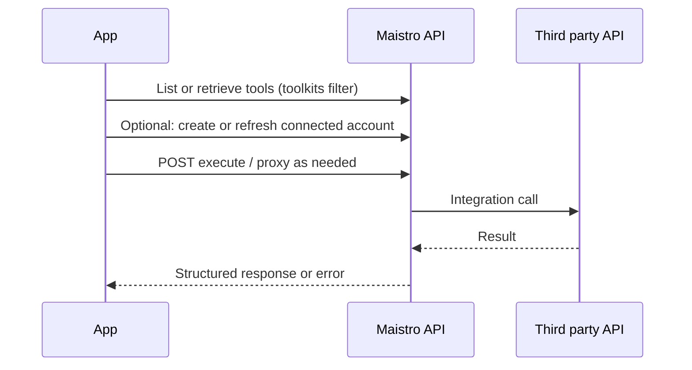
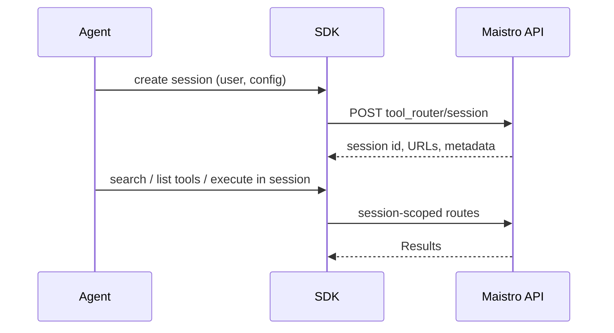

## Tool lifecycle (direct execution)

A typical **direct** integration loads tool definitions, optionally ensures a **connected account** exists, then **executes** a tool with arguments.

Wire operations (v3.1 paths—see [API reference](/reference/api-reference)) include:

- **Discovery:** `GET /api/v3.1/tools`, `GET /api/v3.1/toolkits/...`, `GET /api/v3.1/tools/{tool_slug}`
- **Execution:** `POST /api/v3.1/tools/execute/{tool_slug}` (and related input/proxy routes)

SDKs centralize this in `Tools` (`maistro.tools` in Python). Execution parameters include `user_id`, optional `connected_account_id`, toolkit **version**, and tool arguments.

## Tool Router lifecycle (agentic sessions)

**Tool Router** is the session-based path for agents: one session scopes available toolkits, discovery (search), and execution that can differ from one-shot `tools.execute`.

Important v3.1 path family: `/api/v3.1/tool_router/session/...` including:

- Create and retrieve session
- `.../execute`, `.../execute_meta`, `.../proxy_execute`
- `.../toolkits`, `.../tools`, `.../search`, `.../link`
- File mounts: `.../mounts/{mount_id}/...` (upload URL, download URL, delete)

SDK mapping:

- TypeScript: `Maistro.toolRouter`, plus `create` / `use` on `Maistro`; implementation in `ToolRouter`, `ToolRouterSession`, session file helpers.
- Python: `tool_router` on `Maistro`, same session concepts.

Product-level introduction: [How Maistro works](/docs/how-maistro-works) and [Sessions vs direct execution](/docs/sessions-vs-direct-execution).

## Auth-required flow

When a toolkit needs OAuth or stored credentials:

1. **Auth configs** describe how auth is set up for a toolkit.
2. **Connected accounts** represent a user’s linked account.
3. **Link** endpoints start or complete connection flows.

The SDK `ConnectedAccounts` and `AuthConfigs` models wrap the **Auth Configs** and **Connected Accounts** OpenAPI tags. For end-user UX patterns, see [Authenticating users](/docs/authenticating-users).

## File handling

**Files** tag operations support listing and upload request flows (`/api/v3.1/files/...`). Separately, **Tool Router session mounts** expose upload/download URLs for session-scoped file workflows.

SDKs may **auto-upload / auto-download** file parameters around tool execution when enabled—logic lives in the SDK (`FileToolModifier`, Python file helpers) on top of API calls. See toolkit versioning and modifiers in [Tools guides](/docs/tools-direct).

## MCP

The **MCP** tag covers MCP server resources: listing servers, custom server creation, URL generation, and instance management under `/api/v3.1/mcp/...`.

The SDK `MCP` model maps to these routes. For choosing MCP vs native tools, see [Native tools vs MCP](/docs/native-tools-vs-mcp).
